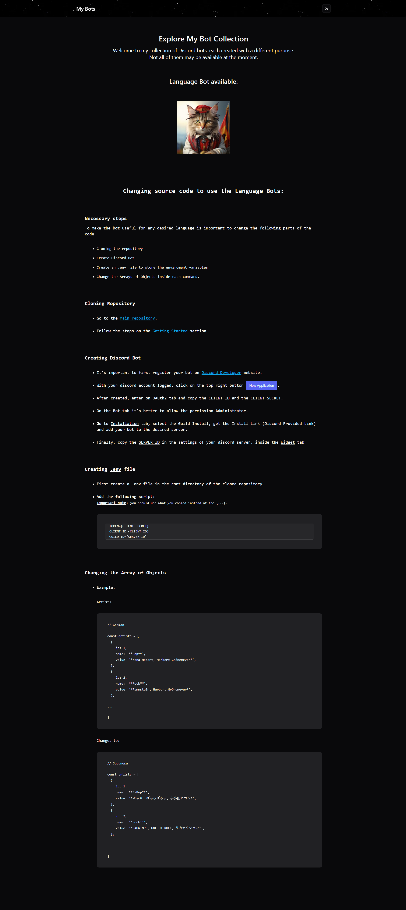

    
    <h1>My Bots Website</h1>

    <a href="#overview"> Overview</a>
    &middot;
    <a href="#note">Note</a> 
    &middot;
    <a href="#more">More</a>
    &middot;
    <a href="https://my-bots.netlify.app/">Website</a>

 

## Overview

This website was created to showcase my collection of discord bots, it's still missing bots but soon enough it will be updated not only with new bots but also with new commands and better interaction.

## Note

The website was created with the purpose of not only showing the bots but also teach about how to use it correctly, hope it explains how to set your own bot.

## Website Preview

## Tech

    
    
    
    

## More

For more information about the bot mentioned in the website visit the [repository](https://github.com/IgorDGomes/German-Helper-Discord-Bot).

## License

This project is [MIT licensed](https://github.com/IgorDGomes/Study-Bots-Website/blob/main/LICENSE).